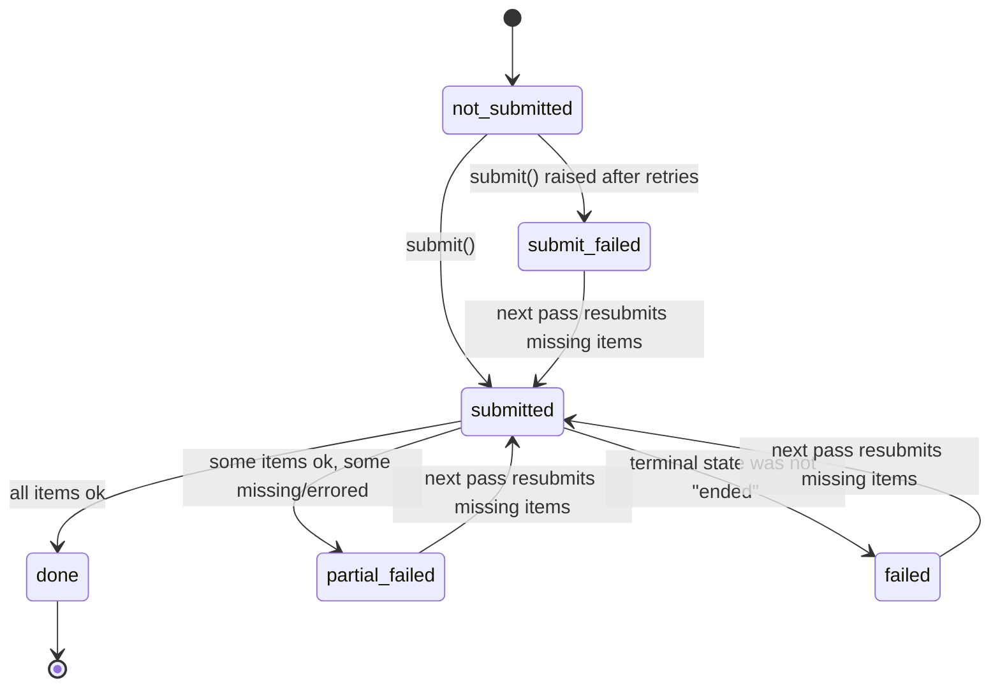

# polybatch

Fault-tolerant, resumable batch-inference orchestrator for OpenAI, Anthropic,
and Google, plus a keyless mock provider for local testing. polybatch fans
out large batches of inference requests to a provider, tracks every chunk's
state through a crash-safe JSON tracker, round-trips a stable order id
through each request's `custom_id` so results always reassemble correctly,
splits oversized inputs into provider-safe chunks, and keeps re-sending
whatever is missing or failed until it can prove 100% coverage of the
input. It runs out of the box with zero API keys and zero cost via a
built-in mock provider that simulates real-world batch failure modes
(dropped items, item-level errors, transient submit failures, expired
jobs).

## Capabilities

- Multi-provider fan-out: OpenAI, Anthropic, Google (Gemini), and a keyless
  mock provider, all behind one `Provider` interface.
- Per-provider chunking that respects each provider's batch-size limits,
  with automatic shrink-and-rechunk if a batch is rejected as too large.
- Order-id tracking: every request carries a stable `order_id` through
  `custom_id`, so results reassemble correctly regardless of provider
  ordering or partial completion.
- Async polling of provider batch jobs to their terminal state.
- Crash-safe resume: a JSON tracker records every chunk's state, so an
  interrupted run picks up in-flight jobs instead of resubmitting them.
- Failure detection and automatic re-send: missing, errored, or dropped
  items are re-submitted pass after pass until full coverage is reached
  (or a pass limit is hit).
- Runs with zero keys and zero cost by default, via the mock provider and
  the `polybatch demo` command.

## Install

```
pip install -e .
```

The core is stdlib-only: no runtime dependencies are required to run the
mock provider, the CLI, the tracker, or the demo. Provider SDKs are opt-in
extras, installed only when you want to talk to a real API:

```
pip install -e ".[openai]"
pip install -e ".[anthropic]"
pip install -e ".[google]"
pip install -e ".[dev]"     # pytest, for running the test suite
pip install -e ".[all]"     # every provider SDK
```

## Quickstart

Run the scripted, self-contained demo (no keys, no network):

```
polybatch demo
```

or, without installing the console script:

```
python -m polybatch.cli demo
```

Run a job against the sample dataset with the mock provider:

```
polybatch run --input data/records.csv --provider mock --run-id 1
```

Check tracked chunk state at any time:

```
polybatch status --tracker outputs/tracker.json
```

Get an offline token/cost estimate before spending anything on a real
provider:

```
polybatch cost --input data/records.csv --model gpt-4o-mini
```

## Demo walkthrough

`polybatch demo` builds 300 in-memory synthetic records and runs them
through the mock provider twice against the same tracker, using a pinned
"golden" chaos scenario: 10% of items come back as item-level errors, 10%
of items are silently dropped from the batch, and 30% of submit attempts
fail transiently (simulated HTTP 429s). Here is real, unedited output from
`python -m polybatch.cli demo --seed 7`:

```
============================================================
polybatch demo -- fault-tolerance narrative
============================================================
seed=7  records=300  output_dir=<temp dir>

Act 1: chaos run
  injecting: 10% item errors, 10% dropped items,
             30% transient submit failures (simulated 429s)
  watch the orchestrator re-send only what's missing, pass by pass

[pass 1] 300 missing -> 3 chunks
[pass 2] 68 missing -> 1 chunks
[pass 3] 19 missing -> 1 chunks
[pass 4] 4 missing -> 1 chunks
[pass 5] 1 missing -> 1 chunks

Act 1 result: passes=5 resent_items=92 coverage=100.0% converged=True

Act 2: idempotent rerun (same tracker, same output CSV)
  coverage is already 100% -- expect 0 resubmits

Act 2 result: submitted_chunks=0 resent_items=0 coverage=100.0%

============================================================
DEMO PASSED -- fault tolerance verified end to end
============================================================
```

**Act 1** shows the multi-pass coverage loop at work: pass 1 submits all
300 records in 3 chunks; despite the injected chaos, each subsequent pass
computes exactly which order ids are still missing from the output CSV and
re-submits only those, converging to 100% coverage in 5 passes while
resending 92 items in total (out of 300 originals).

**Act 2** reruns the identical job against the same tracker and output.
Coverage is already 100%, so the orchestrator submits nothing at all -- a
true no-op rerun, which is the core crash-safety guarantee: resuming a
finished (or partially finished) run never re-does work it already did.

**Coverage guarantee**: `polybatch run` and the demo do not stop until
every input record's `order_id` is present in the output CSV, or the
`--max-passes` budget is exhausted -- whichever comes first.

## CLI reference

### `polybatch run`

Load records from a CSV and run the orchestrator against a provider.

| flag | default | meaning |
| --- | --- | --- |
| `--input` | (required) | input CSV, must have an `order_id,text` header |
| `--run-id` | `1` | run identifier (int) |
| `--provider` | `mock` | `mock` \| `openai` \| `anthropic` \| `google` |
| `--model` | adapter default | model name override for real providers |
| `--output-dir` | `outputs` | output directory |
| `--tracker` | `outputs/tracker.json` | tracker JSON path |
| `--poll-interval` | `0.5` | seconds between polls |
| `--seed` | `0` | mock provider seed |
| `--limit-items` | none | cap the number of records loaded |
| `--error-rate` | `0.0` | mock: fraction of items returned as errors |
| `--drop-rate` | `0.0` | mock: fraction of items dropped (partial batch) |
| `--submit-failure-rate` | `0.0` | mock: probability submit raises a transient error |
| `--expire-rate` | `0.0` | mock: probability a job's terminal state is expired |
| `--max-passes` | `5` | max coverage re-send passes per run |
| `--backoff-base` | `0.5` | base seconds for exponential submit-retry backoff |

The rate flags (`--error-rate`, `--drop-rate`, `--submit-failure-rate`,
`--expire-rate`) only affect the mock provider.

### `polybatch status`

| flag | default | meaning |
| --- | --- | --- |
| `--tracker` | `outputs/tracker.json` | tracker JSON path |

Prints an ASCII table of `chunk / status / job_id` from the tracker file.

### `polybatch cost`

Offline token/cost estimate for a batch job -- no network calls.

| flag | default | meaning |
| --- | --- | --- |
| `--input` | (required) | input CSV, must have an `order_id,text` header |
| `--model` | (required) | model name to price against (see `polybatch/cost.py`) |
| `--max-tokens` | `64` | assumed output token budget per item |
| `--limit-items` | none | cap the number of records loaded |

### `polybatch demo`

| flag | default | meaning |
| --- | --- | --- |
| `--seed` | `7` | mock provider seed |
| `--output-dir` | none | output directory (default: a fresh temp dir, cleaned up unless `--keep`) |
| `--keep` | off | keep the (temp) output directory instead of deleting it |

## How the fault tolerance works (design)

- **Order-id round-trip**: every request's `custom_id` is built as
  `run_{run_id}_item_{order_id}`. Whatever a provider does internally with
  ordering, batching, or partial failures, results are always matched back
  to the original record by parsing the order id out of `custom_id`.
- **Tracker state machine**: a JSON file (`Tracker`, in
  `polybatch/core/tracker.py`) records the state of every chunk --
  `not_submitted` (implicit, key absent), `submitted` (with a `job_id`),
  and the terminal states `done`, `partial_failed`, `failed`, and
  `submit_failed`. Every state transition is saved atomically (write to a
  temp file, then `os.replace`) immediately after it happens, before any
  further side effect, so a crash can never leave the tracker file in a
  half-written state.
- **Chunking**: `split_requests` greedily packs requests into chunks that
  respect a provider's `max_items_per_batch` (and a token-budget estimate),
  preserving input order.
- **Multi-pass coverage re-send**: after an initial submit pass, the
  orchestrator recomputes which `order_id`s are still missing from the
  output CSV (by reading the CSV itself -- the source of truth), builds
  fresh requests only for those records, chunks and submits them, and
  repeats -- up to `--max-passes` times or until nothing is missing.
- **Step-0 resume drain**: before any coverage math runs, the orchestrator
  scans the tracker for chunks left in the `submitted` state with a
  `job_id` from a previous, crashed run and polls/fetches those jobs
  first. This guarantees in-flight work from a crash is picked up and
  counted, never re-submitted and never double-charged.
- **Exponential backoff on transient submit errors**: a provider's
  `TransientSubmitError` (e.g. a simulated or real HTTP 429) is retried
  with backoff `min(backoff_cap, backoff_base * 2**(attempt-1))`, up to a
  fixed number of attempts, before the chunk is marked `submit_failed`.
- **BatchTooLargeError -> shrink-and-rechunk**: if a provider rejects a
  batch as too large, the chunk is not blindly retried. Instead the
  orchestrator halves its effective `max_items_per_batch` (down to a floor
  of 1) and re-chunks on the next pass, so oversized batches self-correct
  without manual tuning.

## Tracker state-machine diagram



Plain-ASCII fallback of the same states and `decide()` logic:

```
not_submitted (key absent)
    |
    | submit()
    v
submitted (job_id) ----------------------+
    |          |            |            |
    | all ok   | some ok    | not ended  | submit() raised
    v          v            v            v
  done   partial_failed   failed    submit_failed
    |          |            |            |
    | (skip)   +----- next pass resubmits missing items ------+
    v
  [*]

decide(key):
  DONE                    -> skip
  SUBMITTED (has job_id)  -> resume (poll/fetch that job_id)
  anything else           -> submit
```

## Plug in a real provider

By default, `polybatch run --provider mock` and `polybatch demo` never make
a real network call. Real providers are entirely opt-in and require both
the matching SDK extra and an API key:

1. Copy `.env.example` to `.env` and fill in the key(s) you need:

   ```
   OPENAI_API_KEY=
   ANTHROPIC_API_KEY=
   GEMINI_API_KEY=
   ```

   `polybatch run` loads `.env` automatically (stdlib-only parser, never
   overrides an already-set environment variable). The google adapter
   checks `GOOGLE_API_KEY` first, falling back to `GEMINI_API_KEY` if that
   is unset -- either name works.

2. Install the matching extra:

   ```
   pip install -e ".[openai]"      # or .[anthropic] / .[google]
   ```

3. Run against the real provider:

   ```
   polybatch run --input data/records.csv --provider openai --run-id 1
   polybatch run --input data/records.csv --provider anthropic --run-id 1
   polybatch run --input data/records.csv --provider google --run-id 1
   ```

   If the SDK is missing, the CLI exits 2 with a `pip install
   polybatch[<extra>]` hint. If the API key is missing, it exits 2 naming
   the env var it expected.

**Honesty note**: the real provider adapters (`polybatch/providers/openai.py`,
`anthropic.py`, `google.py`) are unit-tested against fake SDK modules
injected into `sys.modules` -- request building, status normalization,
result parsing, and error-taxonomy mapping are all covered offline, but
none of the three adapters has been exercised against a live API. The
**Google adapter is the least battle-tested** of the three: it uses a
file-based keyed submit/fetch flow with no legacy reference implementation
to check it against, unlike the OpenAI and Anthropic adapters. Treat all
three as a solid starting point, not a validated production integration.

## Project layout

```
polybatch/
  cli.py                 # run / status / cost / demo subcommands
  demo.py                # scripted two-act fault-tolerance narrative
  cost.py                 # offline token/cost estimator
  env.py                  # stdlib .env loader
  core/
    models.py             # Record, Request, Job, TaskSpec, JobStatus, BatchResult
    orchestrator.py        # multi-pass coverage loop, resume drain, backoff
    tracker.py             # crash-safe JSON chunk state machine
    chunking.py            # provider-limit-aware request splitting
    coverage.py             # present/missing order-id computation from CSV
    parsing.py              # tolerant result-line parsing
  providers/
    base.py                # Provider protocol + error taxonomy
    mock.py                 # keyless provider with injectable chaos
    openai.py, anthropic.py, google.py  # real provider adapters
    registry.py              # provider name -> class lookup

data/
  records.csv              # 300-row sample dataset (order_id,text)
  make_dataset.py           # deterministic regenerator for records.csv

tests/
  test_*.py                 # 150 offline, keyless tests
  conftest.py                # shared fixtures (make_records, make_job, ...)
```

## Running the tests

```
pytest -q
```

150 tests, all offline and keyless -- no network access, no API keys, and
no real provider SDKs required (the real-provider tests run against fake
SDK modules injected into `sys.modules`).

## License / status

Feature-complete portfolio project. No license file is currently included;
treat the code as all-rights-reserved unless a LICENSE is added.
