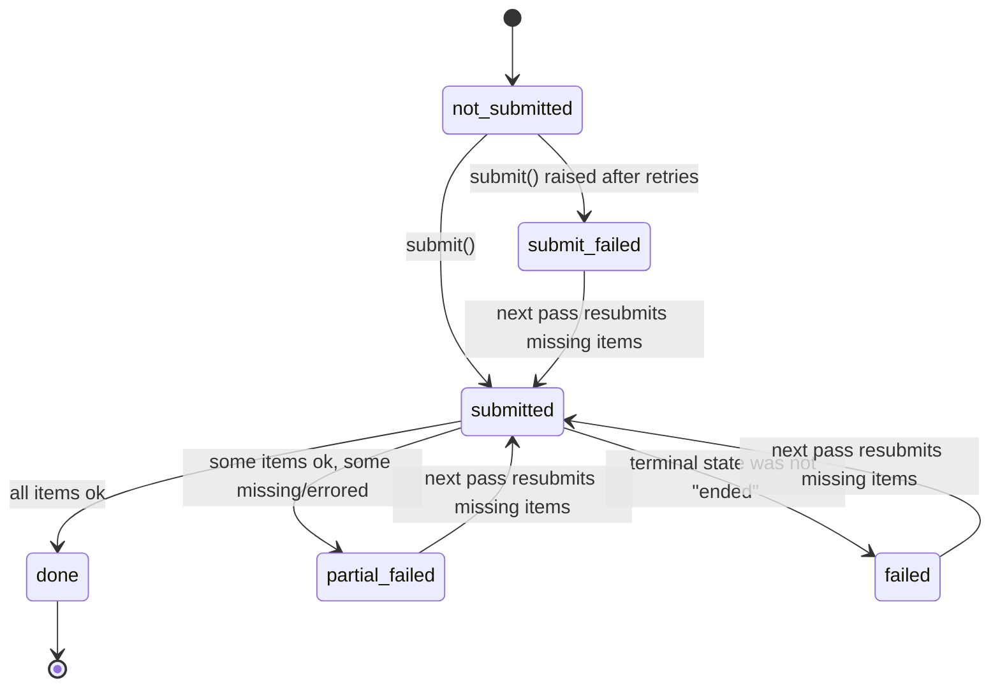

# Relay - Architecture

This document is the engineer-facing deep dive into how Relay achieves
exactly-once execution and provable convergence to 100% coverage over an
unreliable batch-inference provider. It assumes you have read the
[README](../README.md) pitch; this is the mechanism behind it.

## Order-id round-trip

Every request's `custom_id` is built as `run_{run_id}_item_{order_id}`.
Whatever a provider does internally with ordering, batching, or partial
failures, results are always matched back to the original record by
parsing the order id out of `custom_id` with a regex, never by positional
index.

**Why**: never trust provider ordering or assume a batch completes
atomically. Providers can return results out of order, drop items
silently, or complete a batch only partially. A parse-back keyed on a
value round-tripped through the provider's own opaque identifier is
robust to reordering, to partial completion, and to a provider that never
promised ordering guarantees in the first place. The alternative,
assuming result position `i` corresponds to request position `i`, is a
correctness bug waiting for the first dropped item.

## Tracker state machine

A JSON file (`Tracker`, in `relay/core/tracker.py`) records the state of
every chunk:

- `not_submitted` is implicit: the chunk's key is simply absent from the
  tracker.
- `submitted` has a `job_id`; the chunk was handed to the provider and
  is awaiting a terminal result.
- terminal states: `done`, `partial_failed`, `failed`, `submit_failed`.

Every state transition is saved atomically: write the new tracker
contents to a temp file, then `os.replace` it over the real path. `os.replace`
is atomic at the OS level (POSIX `rename(2)`, Windows `MoveFileEx` with
replace semantics), so a reader can never observe a half-written tracker
file: it is either the old complete state or the new complete state,
never bytes of both.

Just as important as the write mechanics is the ordering: the new state
is persisted **before** any further side effect (for example, before the
next chunk is submitted). This means a crash immediately after a
transition can only ever lose forward progress that hadn't started yet --
it can never strand the tracker in a state that misrepresents what
actually happened, and it can never lose the knowledge that a job was
already submitted to the provider.

**Tradeoff**: this buys crash safety at the cost of a full tracker
rewrite on every transition. For the chunk counts Relay targets (tens to
low hundreds per run) this is negligible; it would not scale to a tracker
with millions of chunks without moving to an append-only log or a real
database.

## Exactly-once / step-0 resume drain

Before any coverage math runs, the orchestrator scans the tracker for
chunks left in the `submitted` state with a `job_id` from a previous,
possibly-crashed run, and polls/fetches those jobs **first**, before
computing what (if anything) is still missing and before submitting
anything new.

**Why this gives no-double-charge**: the failure mode this guards against
is a crash between "provider accepted the batch" and "we recorded the
result." Without a resume drain, a naive restart would see no recorded
result for that chunk's items and resubmit them, charging twice for
work the provider already did or is still doing. Because the drain always
runs first and treats an existing `job_id` as authoritative in-flight
work to be collected rather than evidence to be second-guessed, in-flight
work is counted exactly once no matter how many times the process
crashes and restarts. A crash between submit and fetch costs nothing.

## Multi-pass coverage loop

The output CSV, not the tracker, is the source of truth for what has
been completed. Each pass:

1. Reads the output CSV and computes which `order_id`s from the input are
   still missing.
2. Builds fresh requests only for those missing records.
3. Chunks and submits them.
4. Repeats, up to `--max-passes` times or until nothing is missing.

**Why CSV-as-truth**: the tracker records provider-side job state
(submitted, done, failed, ...), but what actually matters for correctness
is whether a usable result was durably written for a given order id. Using
the output CSV as the ground truth for "is this item done" means the
system survives a tracker/CSV divergence (for example a tracker that
says `done` but a CSV write that was interrupted) because the next pass
will simply see the id is still missing from the CSV and re-request it.
It also makes convergence directly checkable: "coverage" is just "count of
distinct order ids present in the output CSV divided by count in the
input," a query anyone can run independently of Relay's internal state.

## Chunking + shrink-and-rechunk

`split_requests` greedily packs requests into chunks that respect a
provider's `max_items_per_batch` (and a token-budget estimate), preserving
input order. If a provider rejects a batch as too large
(`BatchTooLargeError`), the chunk is not blindly retried as-is: the
orchestrator halves its effective `max_items_per_batch` (down to a floor
of 1) and re-chunks on the next pass.

This means oversized batches self-correct without manual tuning: you do
not need to know a provider's exact limit in advance, or hand-tune a
batch size per model; the system converges to a working size within a
small number of passes, at the cost of those extra passes when the
initial guess is too large.

## Exponential backoff

A provider's `TransientSubmitError` (for example a simulated or real HTTP
429) is retried with backoff `min(backoff_cap, backoff_base * 2**(attempt-1))`,
up to a fixed number of attempts, before the chunk is marked
`submit_failed`. A chunk marked `submit_failed` is not lost; it is
picked up again on a later pass through the normal coverage loop, so a
provider that is transiently overloaded does not require operator
intervention, only patience across passes.

## State diagram



Plain-ASCII fallback of the same states and `decide()` logic:

```
not_submitted (key absent)
    |
    | submit()
    v
submitted (job_id) ----------------------+
    |          |            |            |
    | all ok   | some ok    | not ended  | submit() raised
    v          v            v            v
  done   partial_failed   failed    submit_failed
    |          |            |            |
    | (skip)   +----- next pass resubmits missing items ------+
    v
  [*]

decide(key):
  DONE                    -> skip
  SUBMITTED (has job_id)  -> resume (poll/fetch that job_id)
  anything else           -> submit
```

`decide()` is the one function all three mechanisms route through: the
step-0 resume drain, the multi-pass coverage loop, and the crash-safe
tracker all just call it and act on what it returns. A chunk already
`done` is skipped outright (no double work); a chunk `submitted` with a
`job_id` is resumed, never resubmitted (no double charge); anything
else (`not_submitted`, `partial_failed`, `failed`, or `submit_failed`)
is a candidate for submission on the current pass.
